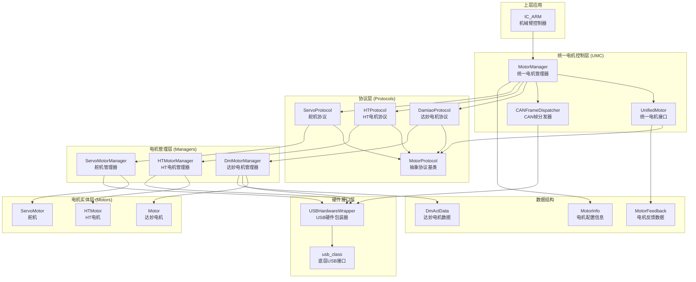
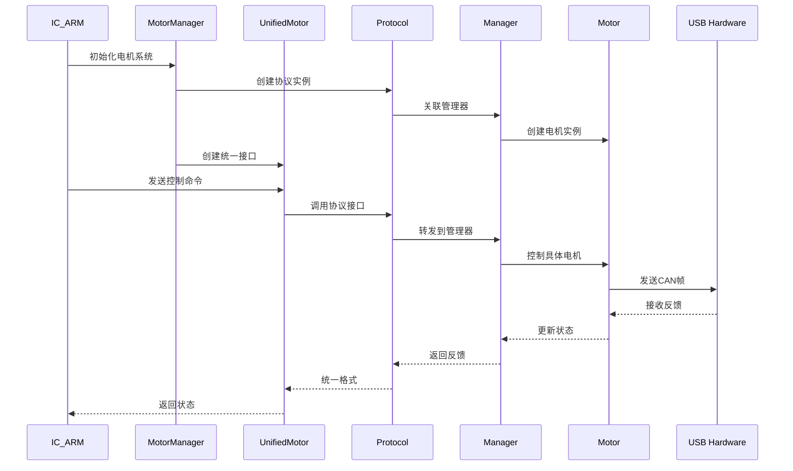
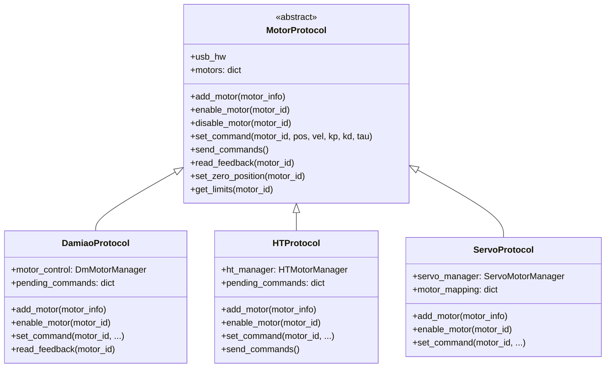
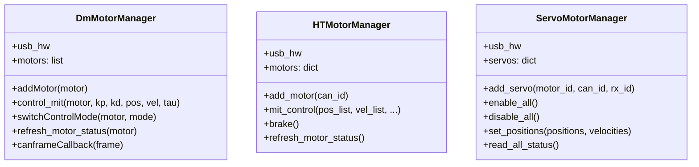
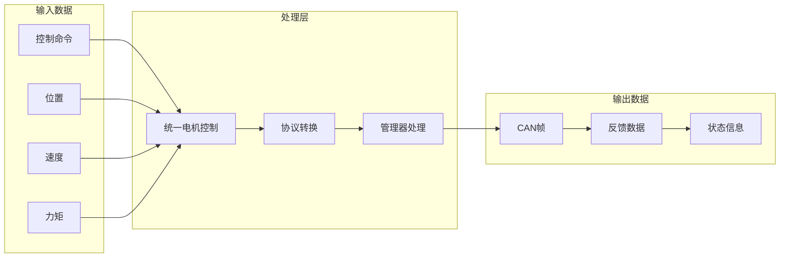

# UMC (Unified Motor Control) 架构关系图

## 整体架构

## 详细组件关系

### 1. 核心控制流程

### 2. 协议层架构

### 3. 管理器层架构

### 4. 数据流向

## 关键特性

### 1. 统一接口
- **UnifiedMotor**: 为所有类型电机提供统一的控制接口
- **MotorManager**: 管理多种电机协议，提供统一的管理功能
- **标准化命令**: 所有电机都使用相同的MIT控制命令格式

### 2. 协议抽象
- **MotorProtocol**: 抽象基类定义了所有电机协议必须实现的接口
- **具体协议**: 每种电机类型都有专门的协议实现
- **CAN帧分发**: 统一处理CAN帧的接收和分发

### 3. 模块化设计
- **分层架构**: 应用层 → 统一控制层 → 协议层 → 管理器层 → 电机层
- **松耦合**: 各层之间通过接口交互，便于扩展和维护
- **可扩展**: 新增电机类型只需实现对应的协议和管理器

### 4. 硬件抽象
- **USB包装器**: 提供统一的USB硬件接口
- **兼容性处理**: 自动处理不同平台的USB库兼容性问题
- **错误处理**: 完善的错误处理和恢复机制
